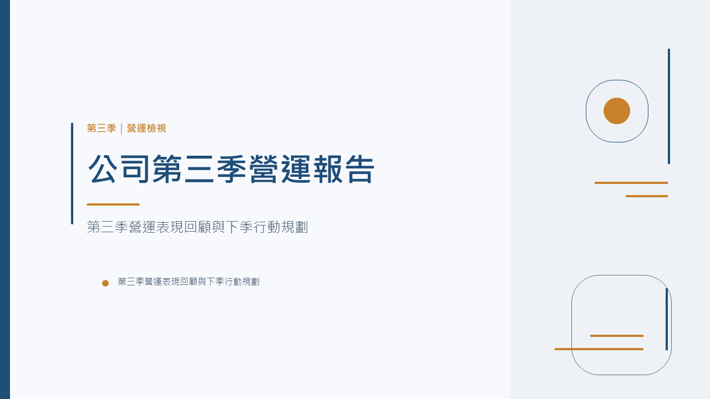
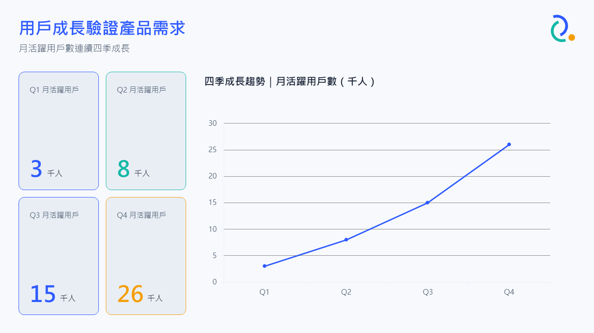

# pptx-agent

用 LLM 把一段簡報大綱轉成 `.pptx`,而且是可以在 PowerPoint 裡直接點選編輯的文字框/圖表,不是排版好之後截圖貼成圖片。

多數用 LLM 產生簡報的做法要嘛輸出「標題+條列」這種制式表單版面,要嘛把整頁畫面截圖貼成圖片換取版面自由度,但後者犧牲了可編輯性。這個專案把兩者拆開處理:先用瀏覽器排版 HTML/CSS 換取版面自由度,再用無頭瀏覽器讀出每個元素的座標、字體、顏色,轉譯成 PowerPoint 原生物件(文字框、形狀、圖片、圖表)。

## 流程

1. **Content Agent**(Python,Azure OpenAI)— 把大綱拆成每頁的結構化內容(標題/要點/數據/時間軸/引言),不碰版面與顏色。
2. **Design System Agent** — 產生一套配色/字型/間距/motif 的設計令牌,後面每一頁只能引用這套令牌,不能自己選色選字。
3. **HTML Layout Agent** — 依內容類型挑版型,用設計令牌寫成 HTML/CSS。這一步只是借用瀏覽器的排版能力,HTML 本身不是最終產出。
4. **Extract**(Node + Playwright)— 無頭瀏覽器渲染上一步的 HTML,對每個元素跑 `getBoundingClientRect()` / `getComputedStyle()`,把座標、字體、顏色萃取成一份 JSON(Slide Object Model)。
5. **Translate**(Node + pptxgenjs)— 依 Slide Object Model 產生 `.pptx`:文字變成 `addText`、色塊變成 `addShape`、有真實數字的數據頁變成原生 `addChart`,漸層/陰影/旋轉這類難以還原的裝飾元素才退回截圖疊圖層。
6. **Visual QA**(選用,迴圈)— 把產出的 `.pptx` 用 PowerPoint 實際渲染成截圖,讓模型對照原始內容檢查有沒有重疊、裁切、對比度不足這類客觀缺陷,有問題的頁面帶著具體修正指示重跑第 3-5 步。

每個階段之間交換的都是結構化 JSON,不是自然語言描述,任一階段都可以單獨重跑除錯。

## 防呆機制

寫 prompt 請 LLM 遵守規則不夠可靠,幾個容易出錯的地方額外加了程式檢查:

- 設計令牌產生後會跑一次 WCAG AA 對比度檢查(文字色對背景/卡片底色至少 4.5:1),不合格的顏色會被自動調整。
- 字型限制在 Windows/Office 內建清單(微軟正黑體等),避免瀏覽器預覽用的字型跟使用者電腦實際開啟時不同,導致換行/溢出跟預覽對不上。
- 萃取階段對旋轉過的裝飾元素(`transform: rotate(...)`)強制走截圖而非幾何轉譯——`getBoundingClientRect()` 回傳的是旋轉後的外接矩形,直接拿來當形狀座標會把一條細線畫成一大塊實心色塊。

## 畫面

同一套 pipeline,不同大綱會產生不同配色跟版型:


大綱提到 AI、募資這類關鍵字時,Design System Agent 傾向選深色調;換一份公司季報大綱,同一套 pipeline 會給出淺色商務風:



大綱裡有實際數字時,數據頁會產生原生 PowerPoint 圖表(可雙擊編輯內嵌資料),而不是畫出來的假圖表:



文字框在 PowerPoint 裡可以直接點選編輯:


## 安裝

```bash
cp .env.example .env   # 填入 Azure OpenAI 設定
uv sync
cd node && npm install && npx playwright install chromium && cd ..
```

## 使用

```bash
uv run pptx-agent --outline "你的簡報大綱..." --slides 6
```

預設會一路跑完內容/設計/排版 → 幾何萃取 → 轉成 `.pptx` → 視覺 QA 迴圈 → 結構驗證 → 自動開啟。輸出在 `outputs/<timestamp>/`。

| 參數 | 說明 |
|---|---|
| `--outline-file <path>` | 大綱改用檔案輸入 |
| `--slides N` | 期望投影片張數(提示,非強制) |
| `--qa-rounds N` | 視覺 QA 迴圈輪數,預設 1,`0` 關閉(僅 Windows + PowerPoint) |
| `--html-only` | 只做到 HTML 預覽,不轉成 `.pptx` |
| `--no-open-result` | 完成後不要自動開啟 |

單獨跑結構驗證:

```bash
uv run python -m pptx_agent.validate outputs/<timestamp>
```

檢查每頁都有可編輯文字框、非純文字視覺元素,以及頁數跟 `content.json` 一致。

## 專案結構

```
src/pptx_agent/
  agents/            content_agent / design_agent / layout_agent / qa_agent
  color_contrast.py  WCAG 對比度計算與自動修正
  fonts.py           字型安全清單
  pipeline.py        Content -> Design -> Layout -> deck.html
  pptx_render.py     PowerPoint COM 自動化,供視覺 QA 用
  validate.py        結構驗收檢查
  cli.py             `pptx-agent` 指令入口
node/
  extract.js         Playwright 幾何萃取
  translate.js       pptxgenjs 轉譯,含原生圖表
```

## 已知限制

- 視覺 QA 迴圈跟 PowerPoint COM 自動化只能在 Windows 上跑;沒有 PowerPoint 的環境會自動跳過這步,其餘流程不受影響。
- 文字框寬度會刻意放寬 12% 再排版,避免瀏覽器跟 PowerPoint 對中文字寬的量測差異造成裁切,代價是偶爾文字會貼近卡片邊緣。
- 漸層、陰影、SVG、旋轉過的裝飾元素一律轉成截圖疊圖層,不是原生可編輯物件。

## 需求

- Python 3.12+ / uv
- Node.js 20+ / npm
- Windows + PowerPoint(選用,視覺 QA 與人工檢查用)
